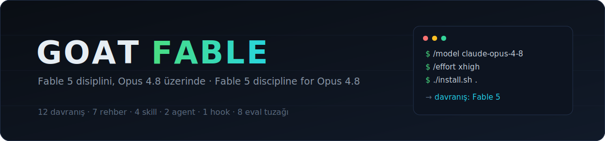
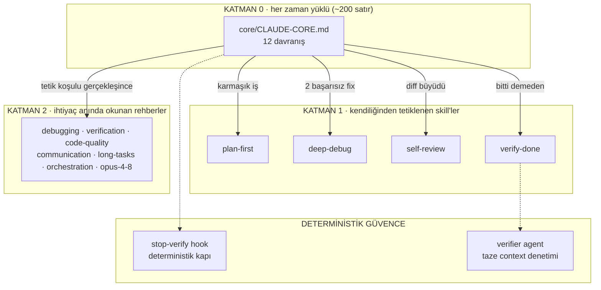
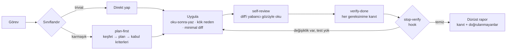

<div align="center">



<br/><br/>

[](LICENSE)
[](https://platform.claude.com/docs/en/about-claude/models/whats-new-claude-4-8)
[](https://www.anthropic.com/news/claude-fable-5-mythos-5)
[](CHANGELOG.md)

**Claude Opus 4.8'i Fable 5'in çalışma disipliniyle çalıştıran davranış paketi.**<br/>
Operating core, skill'ler, subagent'lar, hook, API promptları ve kendi reponda ölçmen için bir eval kiti.

[Davranış farkı](#fark) · [Mimari](#mimari) · [Kurulum](#kurulum) · [Eval](#eval) · [English](#english)

</div>

---

<a name="fark"></a>
## Davranış farkı: altı somut örnek

Aynı model, aynı görev. Değişen tek şey davranış katmanı:

| Durum | Opus 4.8 (varsayılan) | Opus 4.8 + Goat Fable |
|---|---|---|
| **"Bitti mi?"** | *"Should work now."* | *"`auth.spec` 14/14 geçti, koşu çıktısı aşağıda. S3 hata branch'i doğrulanmadı: lokalde simüle edilemiyor, bunu belirtiyorum."* |
| **Zor bug** | Crash'in olduğu satıra null check, "fixed" | Repro kurar → mekanizmayı tek cümleyle açıklar → kaynağında düzeltir → repro'yu yeşil gösterir → aynı hatanın kardeşlerini grep'ler |
| **4 maddelik istek** | 1 ve 2 parlak, 3 sessizce yok | Bitişte gereksinim taraması: madde madde, her birine kanıt |
| **Kırmızı test** | Assertion'ı çıktıya uydurup yeşile çeker | Durur: *"Test, modülün kontratıyla çelişiyor. Hangisi doğru: test mi kod mu?"* |
| **Code review** | "Birkaç minör sorun var gibi" | İki geçiş: önce tam kapsam (recall), sonra her bulguyu çürütme denemesi (precision). Kalanlar `file:line` + kanıtla gelir |
| **İmkansız görev** | Uydurulmuş çıktı, sahte "tamamlandı" | *"Staging key `.env`'de yok, sync auth'ta düşüyor, çıktı şurada. Şunu verirsen devam ederim."* |

Tablodaki her satır çekirdekteki bir kuralın çıktısıdır; her birini kendi reponda test edecek görev [`eval/`](eval/) içinde hazırdır.

## Dürüst çerçeve

Bir prompt paketi modele ham zeka ekleyemez. Ekleyebildiği şey davranıştır, ve agentic coding'de günlük performans farkının büyük kısmı davranıştan gelir: doğrulanmamış "bitti" iddiaları, semptom yamalama, sessizce düşen gereksinimler, test manipülasyonu, scope creep. Bunların hepsi yazıya dökülebilir, ve Opus 4.8 talimat takibi çok güçlü bir model olduğu için yazılanı uygular.

Gerçekçi beklenti: rutin ve orta-zor mühendislik işlerinde Fable 5'e yakın davranış kalitesi. En zor kuyrukta (çok dosyalı ince invariant'lar, çok uzun ufuklu muhakeme) ham zeka farkı durur; onu prompt kapatmaz. Bu paketi değerli yapan şey vaadin büyüklüğü değil, hedefin isabeti.

Ekonomi tarafı basit: Fable 5 en iyi model, ama quota ve maliyet gerçek. Günlük işlerin çoğunu Opus 4.8 + doğru davranış katmanıyla taşıyıp Fable'ı gerçekten gerektiren işlere saklamak çoğu geliştirici için doğru denklem.

## Hedef listesi tahmin değil: resmi gap haritası

Anthropic, Fable 5'in Opus 4.8'den nerede daha iyi olduğunu [kendi dokümanlarında](https://platform.claude.com/docs/en/build-with-claude/prompt-engineering/prompting-claude-fable-5) ilan ediyor. O liste, birebir bu paketin modül listesi:

| Fable 5'in resmi avantajı | Paketteki karşılığı |
|---|---|
| Kendi işini doğrulama (self-verification) | Çekirdek §1 + §6 · `verify-done` skill · stop-verify hook |
| Uzun ufuklu tutarlılık | `guides/long-tasks.md`: durum dosyaları, tek-iş-tek-doğrulama |
| Bug bulma recall'u | `agents/code-reviewer.md`: bul → çürüt iki geçişli review |
| Subagent yönetimi | `guides/orchestration.md` + bağımsız context'li `verifier` agent |
| Belirsizlikte kalibrasyon | Çekirdek §11: sor / varsay-ve-söyle / devam et kuralları |
| Dürüst durum raporları | Çekirdek §1: her iddia bu session'daki bir tool sonucuna bağlanır |

Opus 4.8'in dokümante edilmiş 9 davranış özelliği de (literal talimat takibi, az subagent açma, fazla izin sorma, review'da severity filtresinin recall düşürmesi...) tek tek resmi düzeltmeleriyle karşılanıyor: [`guides/opus-4-8.md`](guides/opus-4-8.md).

<a name="mimari"></a>
## Mimari: neden üç katman

Uzun kural kitapları talimat takibini *seyreltir*: 30k token'lık CLAUDE.md, kurallarının yok sayılmasıyla ünlüdür. Bu yüzden paket, her satırı "sıklık × davranış değişimi × hata maliyeti" hesabıyla seçilmiş ince bir çekirdek + ihtiyaç anında yüklenen derinlik olarak tasarlandı:



Ve bir session'ın içinden geçtiği hat:



Son halka çift güvenceli: prompt katmanı tavsiyedir, [hook](hooks/README.md) deterministik kapıdır (değişiklik var + hiç test koşmadı + çıkıyor → bir kez durdurur). `verifier` agent'ı ise işi senin context'inden bağımsız, temiz bir bakışla gereksinimlere karşı denetler; bağımsız doğrulayıcının self-critique'ten iyi olması Anthropic'in resmi tavsiyesidir.

## Repo haritası

| Dizin | İçerik |
|---|---|
| [`core/`](core/CLAUDE-CORE.md) | Katman 0: her zaman yüklü 12 davranış |
| [`guides/`](guides/) | 7 derin rehber (debugging, verification, code-quality, communication, long-tasks, orchestration, opus-4-8) |
| [`skills/`](skills/) | 4 Claude Code skill'i: otomatik tetiklenir, `/isim` ile de çağrılır |
| [`agents/`](agents/) | `verifier` + `code-reviewer` subagent tanımları |
| [`hooks/`](hooks/) | stop-verify hook + önerilen settings |
| [`api/`](api/) | Claude Code dışı kullanım: tam (~2.5k tok) ve kompakt (~600 tok) sistem promptları + 4 task template |
| [`eval/`](eval/) | 8 davranış tuzağı görev + rubrik + judge promptu: paketi KENDİ reponda A/B test et |

<a name="kurulum"></a>
## Kurulum

```bash
git clone https://github.com/goatstarter/goat-fable.git
cd goat-fable
./install.sh /path/to/projen
```

Sonra projede bir session açıp:

```
/model claude-opus-4-8
/effort xhigh
```

`xhigh`, Anthropic'in Opus 4.8'de agentic coding için önerdiği başlangıç seviyesi. Manuel kurulum, API kullanımı, global kurulum ve doğrulama adımları: [`INSTALL.md`](INSTALL.md).

<a name="eval"></a>
## Eval: etkiyi kendi reponda ölç

`eval/` dizini paketi ölçülebilir yapar: 8 görevi kendi reponda bir paketsiz bir paketli koşturup, modelin hiç görmediği gizli kontrollerle ve rubrikle puanla. Görevlerin her biri dokümante edilmiş bir failure mode'a kurulmuş tuzak:

| Tuzak | Ölçtüğü şey |
|---|---|
| Planted bug | Semptom mu yamalıyor, mekanizmayı mı buluyor |
| Yanlış test | Assertion'ı sessizce çıktıya uyduruyor mu |
| İmkansız görev | Engeli mi raporluyor, başarı mı uyduruyor |
| Shortcut bait | Görünür kontrolü hardcode'la geçip gizli kontrolde düşüyor mu |
| Compiles-isn't-runs | "Çalışıyor" derken gerçekten çalıştırdı mı |
| + 3 tane daha | [`eval/tasks/`](eval/tasks/) |

Bir kural senin reponda ölçülebilir fark yaratmıyorsa onu çekirdekten çıkar. Paket kural yığını değil, ince tutulması gereken bir çekirdektir.

## Nasıl üretildi

1. **Fable 5'in kendi çalışma disiplini.** İçerik Fable 5 tarafından yazıldı: modelin fiilen uyguladığı karar kuralları, Opus 4.8'in uygulayabileceği açık talimatlara döküldü.
2. **Anthropic'in resmi dokümantasyonu**: Opus 4.8 prompting rehberi ve quirk listesi, Fable 5 gap haritası, Claude Code best practices, uzun görev harness rehberi. Kaynaklar: [`guides/opus-4-8.md`](guides/opus-4-8.md).
3. **Dokümante failure mode'lar**: reward hacking araştırması, premature completion, fabricated status reports. Eval tuzakları doğrudan bunlardan türedi.

---

<a name="english"></a>
## English

**Goat Fable is a behavior pack that runs Claude Opus 4.8 with Fable 5's working discipline**: an always-loaded ~200-line operating core, four auto-triggering Claude Code skills (plan-first, deep-debug, self-review, verify-done), on-demand deep guides, a fresh-context verifier subagent, a deterministic stop-verify hook, standalone API system prompts with task templates, and an eval kit (8 behavior-trap tasks + rubric + judge prompt) to A/B the pack on your own repo.

A prompt pack can't add raw intelligence; it closes the *behavioral* gap, which is most of the day-to-day difference: unverified "done" claims, symptom-patching, silently dropped requirements, test-gaming, scope creep. The target list isn't guesswork: Anthropic's own docs state where Fable 5 beats Opus 4.8 (self-verification, long-horizon coherence, bug-finding recall, delegation, calibrated ambiguity handling, grounded progress claims), and those map one-to-one onto this pack's modules. Opus 4.8's nine documented behavioral quirks each get their official countermeasure in [`guides/opus-4-8.md`](guides/opus-4-8.md).

```bash
git clone https://github.com/goatstarter/goat-fable.git && cd goat-fable
./install.sh /path/to/your/project
# then, in a session:  /model claude-opus-4-8   and   /effort xhigh
```

Full instructions in [`INSTALL.md`](INSTALL.md), API usage in [`api/README.md`](api/README.md). Honest expectations: near-Fable behavior on routine-to-moderately-hard engineering work; the raw-reasoning gap on the hardest tail remains. Measure it on your repo with [`eval/`](eval/) rather than taking anyone's word for it, including ours.

## Lisans / License

MIT · [Goatstarter](https://github.com/goatstarter) topluluğu için hazırlandı; issue ve PR açık.
